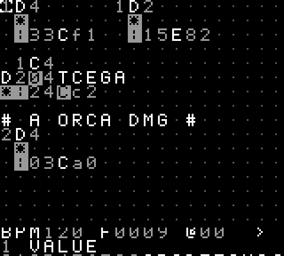
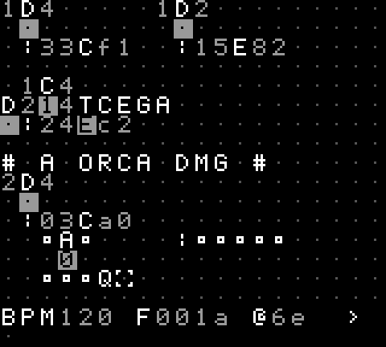
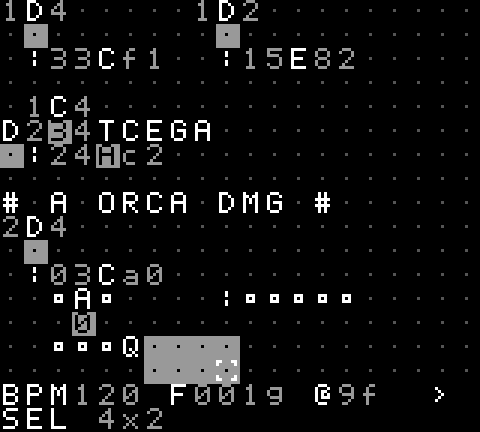
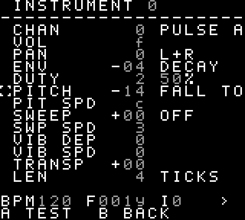
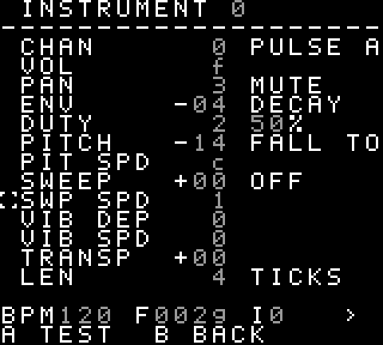

# ORCA/DMG

A port of [ORCA](https://100r.co/site/orca.html) — Hundred Rabbits' livecoding
sequencer — to the original Game Boy (DMG-01).

All 26 lettered operators are here, ported one-to-one from
[orca-c](https://github.com/hundredrabbits/orca-c)'s `sim.c`: the same port
model, the same locking rules, the same base-36 arithmetic, the same
"uppercase runs every frame, lowercase runs only when banged" contract. What
changed is everything around the language — the grid is 32×16 instead of
unbounded, there is no keyboard, and `:` plays an *instrument* on the DMG's
own sound chip instead of sending MIDI.

 

> **Status.** Runs on a real DMG. The VM is covered by host-side tests and the
> ROM by PyBoy.

## Build

The only thing you need to build the ROM is
[GBDK-2020](https://github.com/gbdk-2020/gbdk-2020) 4.5.0 or later. The
generated sources are committed, so no Python is required for a plain build.

```bash
curl -L -o gbdk.tar.gz \
  https://github.com/gbdk-2020/gbdk-2020/releases/download/4.5.0/gbdk-macos-arm64.tar.gz
mkdir -p ~/toolchains && tar xzf gbdk.tar.gz -C ~/toolchains
```

Pick the tarball for your platform from the
[releases page](https://github.com/gbdk-2020/gbdk-2020/releases); on macOS you
will also need `xattr -dr com.apple.quarantine ~/toolchains/gbdk`. Then:

```bash
make
```

Set `GBDK=` if yours lives somewhere else. The result is
`build/orca-dmg.gb`: 64 KB, MBC5 with battery-backed SRAM, and it runs on any
DMG emulator or on a flash cart.

## Controls

The whole instrument is six buttons, so glyph entry goes through a palette
rather than a keyboard.

| | |
|---|---|
| D-pad | move the cursor |
| A | open the glyph palette (it opens on the glyph already under the cursor) |
| A *in the palette* | insert the selected glyph |
| B *in the palette* | cancel |
| B | erase the cell |
| B + D-pad | drag a selection |
| B + A | cut — the selection if there is one, otherwise the cell |
| SELECT + B | copy |
| SELECT + A | paste at the cursor |
| START | play / pause |
| SELECT + ←/→ | tempo ±1 BPM |
| SELECT + ↑/↓ | tempo ±10 BPM |
| SELECT + START | open / leave the instrument page |
| SELECT + A / SELECT + B *on the instrument page* | save / load pattern **and** instruments to cartridge SRAM |

B does double duty: held, it is a modifier; tapped and let go without having
done anything, it is still the eraser. And because the clipboard is a grid
idea, SELECT+A and SELECT+B mean something else entirely on the instrument
page, which is where saving lives.



Dragging with B marks a rectangle, drawn inverted, with its size in the status
bar. Moving the cursor without B lets it go. The clipboard holds up to 16×16
cells — that is what the Game Boy's 8K of work RAM has left once the grid, the
marks, the tile shadow and the VRAM queue have had theirs — and the drag is
clamped to the same box, so the limit shows up while you can still see it
rather than at the paste.

The grid keeps running while the palette is open — this is still livecoding.
## Sound

`:` does not name a channel. It names one of **36 instruments**, one per
base-36 glyph, and the instrument decides which of the Game Boy's four voices
it lands on and what it sounds like. Operands are read to the east:
**instrument, octave, note, velocity, length**.

So `:24Cf2` is: instrument 2, octave 4, middle C, full velocity, two ticks
long — and whether that comes out as a square, a triangle or a snare is the
instrument's business, not the pattern's. Re-voicing a part is one edit on the
instrument page instead of a rewrite of the grid.

Notes are ORCA's own spelling: `C`–`B` with lowercase for sharps, and letters
past `G` keep climbing the scale. Velocity is `0`–`f` and *scales* the
instrument's own level, so the same instrument can be played soft without
being edited. Length is in ticks; leave the operand off and the instrument's
own default is used.

### When two instruments collide

Two instruments can be pointed at the same channel, and a tick can trigger
both. **The lower instrument number wins.** Requests are collected across the
whole tick and resolved once at the end of it, which is what makes the rule
independent of where the `:` glyphs happen to sit on the grid — an instrument
at the bottom of the pattern still loses to a lower-numbered one at the top,
and vice versa.

## Instruments

 

SELECT+START opens the instrument page; opening it while the cursor sits on a
value glyph jumps straight to that slot. D-pad moves, left/right edits, `A`
auditions the instrument, `B` goes back to the grid.

`A` plays the instrument for its own `LEN` at the current tempo, but counts
that down in frames rather than in ticks — so the note still ends when the
sequencer is stopped, which is exactly when you want to audition one.

The parameter list follows the channel — the wave channel has no hardware
envelope, the noise channel has no period to bend, only the noise channel has
a shape — so rows appear and disappear as you change `CHAN` rather than
sitting there greyed out. The two screens above are the same page on channel 0
and channel 3.

| | |
|---|---|
| `CHAN` | pulse A, pulse B, wave, or noise |
| `VOL` | `0`–`f`; on the wave channel this picks one of its four levels |
| `PAN` | `L+R`, `LEFT`, `RIGHT`, `MUTE` |
| `ENV` | hardware envelope: negative decays, positive swells, `0` holds |
| `DUTY` | 12%, 25%, 50%, 75% — pulse channels |
| `WAVE` | one of eight waveforms — wave channel |
| `NOISE` | 15-bit or 7-bit — the 7-bit mode is the metallic one |
| `SHAPE` | noise only: how far from the note the sound *starts*, in clock-shift steps. It glides back to the note and stops there, so the note is still what decides the timbre you are left with. Negative starts high and falls — a kick or a tom; positive rises; `0` is static |
| `PITCH` / `PIT SPD` | how far the note slides before landing on its pitch, in semitones, and how fast. Negative starts high and falls; `0` is static. Every tonal channel |
| `SWEEP` / `SWP SPD` | the DMG's own sweep unit — pulse A only. Unlike the slide it keeps going for as long as the note does, so this is the one for sirens. While it is on it owns the frequency registers and the software slide stands aside |
| `VIB DEP` / `VIB SPD` | vibrato, applied per frame in software |
| `TRANSP` | −24..+24 semitones |
| `LEN` | gate in ticks, when `:` leaves the operand off |

## Operators

Ports read west/east and write south unless noted. `a` is the west operand,
`b` the east one.

| | | | |
|---|---|---|---|
| `A` add | `a+b` | `N` `E` `S` `W` | move one cell, become `*` if blocked |
| `B` subtract | `\|b-a\|` | `O` read | copy the operand at offset `x+1,y` |
| `C` clock | `tick/a % b` | `P` push | write east operand at `key%len` |
| `D` delay | bang every `a*b` ticks | `Q` query | copy `len` operands from an offset |
| `F` if | bang when `a==b` | `R` random | a value between `a` and `b` |
| `G` generate | write `len` operands at `x,y` | `T` track | pick operand `key%len` |
| `H` halt | freeze the cell below | `U` euclid | euclidean rhythm `a`/`b` |
| `I` increment | step the cell below by `a`, mod `b` | `V` variable | write `a`, or read `b` |
| `J` jumper | carry the north value south | `X` write | write the east operand at `x,y` |
| `K` konkat | read variables named to the east | `Y` yumper | carry the west value east |
| `L` lesser | the smaller of `a` and `b` | `Z` lerp | ease the cell below toward `b` |
| `M` multiply | `a*b` | | |

Plus `*` bang, `#` comment (locks the rest of the line), and `:` note.

## What is not here

* **An unbounded grid.** 32×16, scrolling horizontally under the cursor.
* **Files.** One slot in cartridge SRAM, holding the pattern, the tempo and
  all 36 instruments together.
* `R` uses a 16-bit xorshift instead of orca-c's 32-bit hash — position and
  tick still seed it, so two `R`s on a row do not move in lockstep.
* `J` and `Y` scan to the grid edge instead of orca-c's fixed 256 cells.

## Layout

```
src/            the ROM
tools/          generators, test harnesses and probes
test/           the host-side VM tests
patches/        example and stress patterns
docs/           screenshots

src/orca.c      the VM: portable C, no Game Boy in it, host-testable
src/main.c      editor, renderer, clock, the vram queue
src/audio.c     instruments and the APU driver behind ':'
src/instr.c     the instrument page          (ROM bank 1)
src/edit.c      selection and clipboard      (ROM bank 1)
src/text.c      operator names               (ROM bank 1)
src/font.c      193 tiles (ROM bank 1)        generated by tools/makefont.py
src/notes.c     pitch and wave tables        generated by tools/makenotes.py
src/demo.h      the boot pattern
```

## Credits

[ORCA](https://100r.co/site/orca.html) is by [Hundred
Rabbits](https://100r.co/).

Built with [GBDK-2020](https://github.com/gbdk-2020/gbdk-2020) and tested with
[PyBoy](https://github.com/Baekalfen/PyBoy). Port by Daniil Vlasenko

## Licence

MIT — see [LICENSE](LICENSE). orca-c is MIT (© 2017 Hundredrabbits) and this
port inherits that notice along with its semantics.
